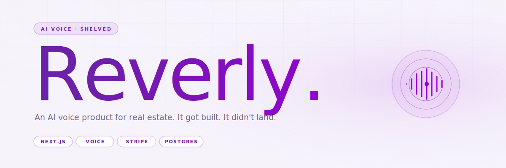

<div align="center">
  
</div>

<p align="center">
  
  
  
  
</p>

<br/>

> **Reverly** was an AI-voice product for real-estate agents — the idea was to let agents run their own calls (lead qualification, open-house follow-ups, missed-call callbacks) on autopilot, with a voice that didn't give the game away.
>
> It shipped. It didn't take. Kept here as the receipt.

<br/>

## What it was

A full SaaS surface: marketing site, auth, dashboard, billing, checkout. Behind it, a voice agent architecture hooked to a Postgres database of leads and call outcomes.

- **Landing page** with hero, features, analytics demo, testimonials, pricing.
- **Auth** (sign-in / sign-up).
- **Dashboard** — per-agent view of leads, call history, scheduled follow-ups.
- **Billing + Stripe checkout** — subscription and one-time.
- **Voice agent** — real-estate-tuned prompt and call handling.
- **API routes** for lead ingestion, call webhooks, billing events.

The UI worked. The plumbing worked. The product… didn't.

<br/>

## Why it didn't stick

The real-estate agents I spoke to weren't the problem. The **compliance layer** around AI-driven calls in Australia is — and getting through it requires a relationship with the industry that I didn't have and couldn't build at speed. The tech was 90% there; the trust infrastructure to sell it was 10%.

Shelving it was the right call. Kept public so it doesn't pretend to be something I'm still working on.

<br/>

## Stack

| Layer | Tech |
|---|---|
| Framework | **Next.js** · App Router · TypeScript |
| UI | **shadcn/ui** · Radix · Tailwind · HeadlessUI |
| Drag-and-drop | `@hello-pangea/dnd` |
| Auth | Custom (middleware-gated routes) |
| Payments | **Stripe** · subscription + one-time |
| DB | Postgres |
| Voice | External voice-agent provider (integration layer only) |

<br/>

## Running locally

```bash
pnpm install
cp .env.local.example .env.local

# Env vars expected:
#   Postgres connection string
#   Stripe keys (publishable + secret + webhook secret)
#   Voice provider API key
#   Auth secrets

pnpm dev
```

None of those env values are bundled — this repo ships the surface, not the connections.

<br/>

## Project layout

```
reverly/
├── app/
│   ├── page.tsx          Landing (hero + features + pricing + testimonials)
│   ├── auth/             Sign-in / sign-up
│   ├── dashboard/        Agent workspace
│   ├── billing/          Plan management
│   ├── checkout/         Stripe-backed purchase flow
│   └── api/              Webhooks + internal endpoints
├── components/
│   ├── hero.tsx
│   ├── features.tsx
│   ├── analytics.tsx
│   ├── testimonials.tsx
│   ├── pricing.tsx
│   ├── footer.tsx
│   └── header.tsx
├── middleware.ts         Auth gate
└── lib/
```

<br/>

## License

No license granted — source visible as a portfolio artefact. **All rights reserved.**

<br/>

---

<p align="center">
  <sub>Built by <a href="https://github.com/KezLahd">Kieran Jackson</a> · Shelved 2025</sub>
</p>
